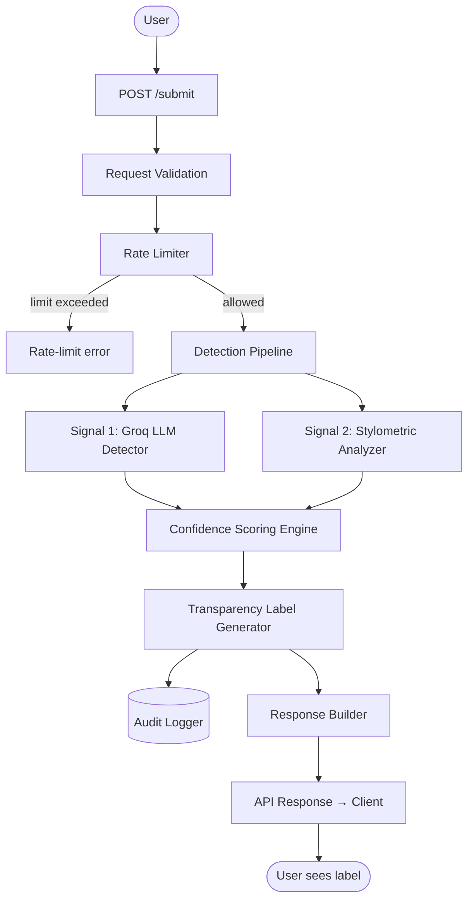
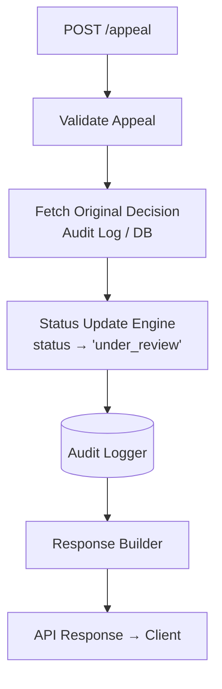
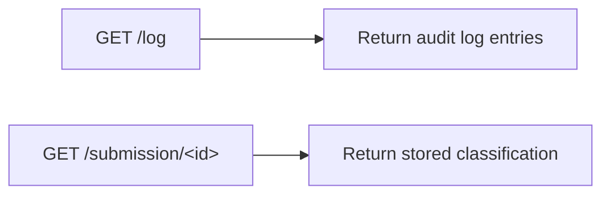

# Provenance Guard — Planning

> An attribution system that estimates whether a piece of text was written by a human or generated by AI, expresses its result as a plain-language transparency label, and records every decision for accountability.

## Table of Contents

1. [Architecture Narrative](#1-architecture-narrative)
2. [System Flow Diagrams](#2-system-flow-diagrams)
3. [Detection Signals](#3-detection-signals)
4. [Confidence & Uncertainty Representation](#4-confidence--uncertainty-representation)
5. [Transparency Labels](#5-transparency-labels)
6. [Appeals Workflow](#6-appeals-workflow)
7. [API Contract](#7-api-contract)
8. [Anticipated Edge Cases](#8-anticipated-edge-cases)
9. [Design Principles](#9-design-principles)
10. [AI Tool Plan](#10-ai-tool-plan)

---

## 1. Architecture Narrative

When a creator submits a piece of text, it is sent to the **Content Submission API** (`POST /submit`), which serves as the entry point into the system. The API first validates the request, ensuring that text is present and within acceptable size limits.

Before any processing occurs, the request passes through the **Rate Limiter** (Flask-Limiter). This prevents abuse by restricting how many submissions a user or IP address can make within a certain time period. If the limit has been exceeded, the API immediately returns a rate-limit error.

If the request is allowed, the text is forwarded to the **Detection Pipeline**, which combines two independent signals — a Groq Llama 3.3-70B LLM detector and a stylometric analyzer (see [Section 3](#3-detection-signals)) — to determine whether the content appears human-written or AI-generated.

The outputs from both signals are passed to the **Confidence Scoring Engine**. Rather than relying on a single detector, this component combines the scores using predefined weights to calculate an overall confidence value, and determines whether the evidence is strong enough to classify the content as AI-generated, human-written, or uncertain (see [Section 4](#4-confidence--uncertainty-representation)). This design intentionally favors uncertainty when the signals disagree, reducing the chance of falsely labeling a human creator's work as AI-generated.

Next, the classification is sent to the **Transparency Label Generator**, which converts the technical classification into plain language (see [Section 5](#5-transparency-labels)). Each label includes clear wording explaining what the system believes and how confident it is.

Once the decision has been made, the **Audit Logger** records the entire event in a structured SQLite database (or JSON log). The log includes the submitted content ID, timestamp, individual signal results, final confidence score, final classification, transparency label, and any later appeals — creating a complete record for accountability and future review.

The API then returns a JSON response to the client containing the content ID, attribution result, confidence score, transparency label, and current status (`"classified"`).

If the creator disagrees with the decision, they can submit an appeal through the **Appeals API** (`POST /appeal`). The Appeals component records the appeal in the audit log, links it to the original submission, and changes the content's status from `classified` to `under_review` (see [Section 6](#6-appeals-workflow)). **No automatic reclassification occurs** — the system preserves the original decision while documenting that the creator has contested it.

Throughout the entire process, every important action — from submission through classification to any later appeal — is logged, ensuring transparency, traceability, and accountability.

---

## 2. System Flow Diagrams

### 2.1 Submission Flow



**Data passed between stages**

| Stage | Output produced |
| --- | --- |
| Request Validation + Rate Limiter | Clean raw text + author metadata |
| Signal 1: Groq LLM Detector | AI probability + reasoning |
| Signal 2: Stylometric Analyzer | Feature-based score |
| Confidence Scoring Engine | Combined weighted probability + final label (AI / Human / Uncertain) |
| Transparency Label Generator | User-facing label text |
| Audit Logger | Full decision record (raw text, both signals, confidence, label, timestamp) |
| Response Builder | `content_id` + classification + confidence + label + status |

### 2.2 Appeal Flow



> The original classification and signals are preserved as a snapshot; the appeal reason is linked to the original `content_id`. No re-classification is triggered.

### 2.3 Read Endpoints



---

## 3. Detection Signals

### Signal 1 — LLM-Based Attribution (Groq Llama 3.3-70B)

**What it measures**

- Global linguistic patterns (fluency, coherence, predictability)
- Likelihood that text resembles LLM-generated output
- Structural regularity and phrasing patterns

The model considers many characteristics simultaneously rather than relying on a single feature.

**Output**

```json
{
  "label": "AI | Human",
  "score": 0.0 - 1.0
}
```

**Why it differs between human and AI writing.** Large language models are trained on massive datasets and tend to produce text with predictable patterns. AI writing is often highly consistent in tone, grammatically polished, evenly structured, and less likely to include unusual phrasing or abrupt shifts in style. Human writing is generally more varied — people naturally introduce inconsistencies, personal voice, emotional expression, and occasional imperfections.

**Blind spots**

- Highly polished human writing → false AI positives
- Edited AI text → false human negatives
- Very short text → unstable predictions
- Becomes less reliable as AI-generated writing grows more human-like

### Signal 2 — Stylometric Heuristics

**What it measures.** Feature-based writing statistics:

- Sentence-length variance
- Vocabulary diversity (type-token ratio)
- Repetition frequency
- Punctuation variability
- Average word-length deviation

**Output**

```json
{
  "ai_likeness_score": 0.0 - 1.0
}
```

- `0` = strongly human-like writing style
- `1` = strongly AI-like writing style

**Why it differs between human and AI writing.** Human writers naturally vary sentence length, vocabulary, and punctuation depending on mood, experience, and purpose. AI-generated writing often produces more regular patterns because it optimizes for fluent, coherent text — for example, humans mix short and long sentences while AI tends toward uniform length.

**Blind spots**

- Formal human writing (academic/legal) looks "AI-like"
- AI paraphrased by humans evades detection
- Very short texts lack statistical stability

### Why the Two Signals Work Well Together

The two signals examine different aspects of the text:

- The **LLM detector** evaluates the writing holistically, using its learned understanding of language patterns.
- The **stylometric analyzer** uses objective, measurable statistics about writing style.

Because they rely on different kinds of evidence, combining them reduces the chance of over-relying on any single indicator. If both signals **agree**, the system assigns higher confidence. If they **disagree**, the system lowers its confidence and may return an *uncertain* classification rather than making an overconfident decision.

---

## 4. Confidence & Uncertainty Representation

### What does `confidence = 0.6` mean?

A score of `0.6` indicates a slight lean toward AI-generated writing, but **insufficient agreement between signals to be decisive**. The system treats such a result as *uncertain* by default unless reinforced.

### Interpretation Bands

| Range | Meaning |
| --- | --- |
| `0.00 – 0.39` | Likely Human |
| `0.40 – 0.69` | Uncertain |
| `0.70 – 1.00` | Likely AI |

### Design Bias

We intentionally bias toward uncertainty to avoid false positives on human creators.

---

## 5. Transparency Labels

Depending on the confidence score, the Transparency Label Generator emits one of three labels:

### High-confidence AI (≥ 0.70)

> **Likely AI-generated content.**
> Our analysis indicates strong evidence that this text was generated using AI systems. This classification is made with high confidence based on multiple signals.

### High-confidence Human (≤ 0.39)

> **Likely human-written content.**
> Our analysis indicates strong evidence that this text was written by a human creator. This classification is made with high confidence based on multiple signals.

### Uncertain (0.40 – 0.69)

> **Uncertain attribution.**
> We found mixed or inconclusive signals in this text. We cannot confidently determine whether it was written by a human or generated by AI. Results are intentionally conservative to avoid misclassification.

---

## 6. Appeals Workflow

### Who Can Appeal?

Only the original content creator (identified via the `author` field, or a user ID in the production version).

### Appeal Submission

**Endpoint:** `POST /appeal`

**Required input**

```json
{
  "content_id": 123,
  "reason": "Explanation of authorship and why classification is incorrect"
}
```

**Optional (future extension)**

- Writing-process details
- External proof links (not required in MVP)

### System Behavior on Appeal

When an appeal is received, the system:

1. Validates `content_id`.
2. Attaches the appeal to the original record.
3. Updates status: `classified → under_review`.
4. Appends an appeal entry to the audit log containing the `content_id`, original classification, confidence score, appeal reason, and timestamp.
5. **Does NOT re-run detection automatically.**

### What a Human Reviewer Would See *(future extension)*

If a review dashboard is added, each appeal entry includes:

- Original text
- Model decision (AI / Human / Uncertain)
- Signal breakdown — Groq score, stylometric score, confidence score
- Creator's appeal reason
- Timestamp of submission
- Current status: `under_review`

---

## 7. API Contract

### 7.1 `POST /submit` — Submit Content

Accepts a piece of text and analyzes whether it was likely written by a human or generated by AI.

**Request**

```json
{
  "author": "Jane Doe",
  "content": "The moon hung low over the quiet lake..."
}
```

**Response**

```json
{
  "content_id": 1,
  "classification": "Human",
  "confidence": 0.91,
  "label": "Likely human-written. Our analysis found strong evidence that this content was written by a person.",
  "status": "classified"
}
```

### 7.2 `POST /appeal` — Submit an Appeal

Allows a creator to contest an attribution decision.

**Request**

```json
{
  "content_id": 1,
  "reason": "This poem is entirely my own work. I wrote it over several weeks."
}
```

**Response**

```json
{
  "message": "Appeal submitted successfully.",
  "content_id": 1,
  "status": "under review"
}
```

### 7.3 `GET /log` — View Audit Log

Returns the structured audit log showing attribution decisions and appeals. No request body.

**Response**

```json
[
  {
    "content_id": 1,
    "classification": "Human",
    "confidence": 0.91,
    "signals": { "groq": "Human", "stylometric": "Human" },
    "status": "classified",
    "timestamp": "2026-06-29T12:15:44"
  },
  {
    "content_id": 2,
    "classification": "AI",
    "confidence": 0.95,
    "signals": { "groq": "AI", "stylometric": "AI" },
    "status": "under review",
    "appeal": "I wrote this myself.",
    "timestamp": "2026-06-29T12:35:18"
  }
]
```

### 7.4 `GET /submission/<content_id>` — View a Single Submission *(optional)*

Retrieves the classification results for one submission. Useful for testing and demonstration.

**Response**

```json
{
  "content_id": 1,
  "author": "Jane Doe",
  "classification": "Human",
  "confidence": 0.91,
  "label": "Likely human-written.",
  "status": "classified"
}
```

### Coverage Summary

| Endpoint | Covers |
| --- | --- |
| `POST /submit` | Content submission, detection, confidence scoring, transparency labels |
| `POST /appeal` | Appeals workflow |
| `GET /log` | Structured audit log |
| `GET /submission/<content_id>` | Individual submission retrieval (optional) |

---

## 8. Anticipated Edge Cases

### Edge Case 1 — Highly Minimalist Poetry

**Example:** `"rain. rain. rain."`

**Why it fails**

- Stylometric features collapse due to extremely low text length
- Repetition looks "machine-like"
- Groq model may overfit to structured repetition patterns

**Result:** False AI classification with inflated-confidence risk.

### Edge Case 2 — Highly Formal Human Writing

**Example:** Legal disclaimers, academic abstracts, technical documentation.

**Why it fails**

- Low stylistic variance
- High lexical precision
- Predictable sentence structure

**Result:** Stylometric model strongly signals AI; combined score may incorrectly shift toward AI.

### Edge Case 3 — Short Social Media Posts (< 30 words)

**Example:** `"can't believe this actually worked lol"`

**Why it fails**

- Not enough data for the stylometric signal
- LLM signal becomes overly dominant
- High variance in confidence

### Edge Case 4 — AI-Edited Human Writing

**Example:** A human draft rewritten using AI tools.

**Why it fails**

- Mixed authorship confuses both signals
- Produces a stable "uncertain" or a false human classification

---

## 9. Design Principles

- Never force binary certainty when signals disagree.
- Prefer false negatives over false positives.
- Treat confidence as a UX feature, not just a numeric output.
- Ensure every decision is explainable via audit logs.

---

## 10. AI Tool Plan

This section defines how AI assistance will be used incrementally across the three implementation milestones. Each milestone provides tightly scoped context to ensure the generated code remains modular, testable, and aligned with the system design.

### M3 — Submission Endpoint + First Signal

#### Spec sections provided to AI tool

- Detection Signals (Signal 1: Groq LLM detector)
- API Contract (`POST /submit`)
- Architecture Diagram (Submission Flow only)
- Edge Case: Short text instability (for awareness, not implementation)

---

#### What I will ask the AI to generate

1. **Flask application skeleton**
   - Basic app structure (`app.py`)
   - Route: `POST /submit`
   - Request validation layer
   - Placeholder for rate limiting (not fully implemented yet)

2. **Signal 1 implementation**
   - Function: `groq_classify(text)`
   - Returns:
     ```json
     {
       "score": 0.0 - 1.0,
       "label": "AI | Human"
     }
     ```

3. **Stub structures for future components**
   - Empty stylometric function placeholder
   - Empty confidence scoring function placeholder
   - Audit log stub (no persistence yet)

---

#### How I will verify output

Before connecting anything to the endpoint:

- Run `groq_classify()` manually on test inputs:
  - Clearly human text (casual, emotional writing)
  - Clearly AI-like structured text
  - Edge case: very short text (“ok”, “hi”, etc.)

- Check:
  - Output is in valid 0–1 range
  - Outputs vary meaningfully across different inputs
  - No hardcoded or static responses

- Ensure Flask route:
  - Accepts JSON
  - Returns placeholder structured response
  - Does not crash on missing fields

#### Generation prompt (verbatim)

The exact prompt handed to the AI tool for this milestone:

> **You are helping build a Flask backend called Provenance Guard, which classifies text as human-written or AI-generated.**
>
> **Design context — Detection Signal 1: Groq LLM Detector**
> - Input: raw text string
> - Output MUST be `{ "score": 0.0 to 1.0, "label": "AI" | "Human" }`, where `score` is the probability of AI-generated text.
>
> **API requirement — `POST /submit`**
> - Accept JSON `{ "author": "string", "content": "string" }`
> - Call the Groq detection function
> - Return a placeholder combined response (confidence scoring not implemented yet)
>
> **Architecture constraint (M3 only):** no stylometric signal, no confidence scoring, no database/logging (stubs allowed).
>
> **Task — generate:**
> 1. Flask app skeleton (`app.py`): Flask setup, `/submit` route stub, JSON request parsing, basic validation (missing `content`/`author` → error response).
> 2. First detection signal function `groq_classify(text: str) -> dict` returning `{ "score": float 0–1, "label": "AI" | "Human" }`. Call the Groq model (mock if needed, but keep the exact interface).
>
> **Strict rules:** do not implement stylometric analysis, confidence scoring, or database/logging yet; match function signatures exactly; keep code minimal and modular.

#### Output verification checklist

What must be confirmed in the AI's output before using it:

**A. Flask route correctness**

- [x] Is `POST /submit`
- [x] Accepts a JSON body
- [x] Extracts `author` and `content`
- [x] Returns a JSON response
- [x] Handles missing fields safely (400 error)

> ⚠️ Common AI mistakes: forgetting `request.get_json()`, returning plain strings instead of JSON, skipping validation.

**B. Signal function correctness** — must match `groq_classify(text: str) -> dict`

- [x] Input is `text: str`
- [x] Output is a `dict`
- [x] Contains `score` (float 0–1) and `label` (`"AI"` | `"Human"`)

> ⚠️ Common AI mistakes: returning a label with no score (or vice versa); using a boolean instead of a probability; returning strings instead of a numeric score.

**C. Architectural correctness**

- [x] Signal function lives outside the Flask route (separate module)
- [x] Route calls the function cleanly
- [x] No premature merging with future pipeline stages
- [x] No stylometric or confidence logic sneaked in early

> **Implementation result.** `groq_classify` lives in `groq_detector.py`; the route in `app.py` calls it and returns a placeholder `{"signals": {"groq": ...}, "status": "received"}` response. All checklist items verified via `python groq_detector.py` (signal smoke test) and Flask's test client (route + validation). The detector calls Groq `llama-3.3-70b-versatile` and degrades to a deterministic, same-interface stub when no API key is present.

---

### M4 — Second Signal + Confidence Scoring

#### Spec sections provided to AI tool

- Detection Signals (Signal 1 + Signal 2)
- Uncertainty Representation (thresholds + interpretation bands)
- Architecture Diagram (full submission flow)
- API Contract (`POST /submit` response structure)

---

#### What I will ask the AI to generate

1. **Stylometric signal implementation**
   - Function: `stylometric_analyze(text)`
   - Outputs:
     ```json
     {
       "ai_likeness_score": 0.0 - 1.0
     }
     ```

2. **Confidence scoring engine**
   - Function: `compute_confidence(groq_score, stylometric_score)`
   - Implements weighted combination:
     - 0.65 Groq
     - 0.35 stylometric
   - Returns:
     ```json
     {
       "final_score": 0.0 - 1.0,
       "classification": "AI | Human | Uncertain"
     }
     ```

3. **Integration into `/submit`**
   - Pipeline wiring:
     - raw text → signal 1 → signal 2 → scoring → response

---

#### What I will check

1. **Score separation test**
   - Input set:
     - Clearly human-written paragraph
     - Clearly AI-generated structured paragraph
   - Expected:
     - Human text → lower AI score
     - AI text → higher AI score
     - Noticeable separation (not clustered around 0.5)

2. **Uncertainty correctness**
   - Mixed or ambiguous inputs should land in:
     - 0.40–0.69 range

3. **Signal independence**
   - Verify stylometric score is not identical to Groq score
   - Ensure signals differ on at least some inputs

4. **Regression safety**
   - Ensure `/submit` still returns valid JSON for all inputs

---

### M5 — Production Layer (Labels + Appeals + Logging)

#### Spec sections provided to AI tool

- Transparency Label Design (all 3 variants verbatim)
- Appeals Workflow
- Architecture Diagram (full system including appeal flow)
- API Contract:
  - `POST /appeal`
  - `GET /log`

---

#### What I will ask the AI to generate

1. **Transparency label generator**
   - Function: `generate_label(confidence_score)`
   - Must return exact prewritten label strings:
     - High-confidence AI
     - High-confidence Human
     - Uncertain

2. **Audit logging system**
   - Structured log entry format:
     ```json
     {
       "content_id": int,
       "timestamp": str,
       "groq_score": float,
       "stylometric_score": float,
       "final_score": float,
       "classification": str,
       "status": str,
       "appeal_reason": optional str
     }
     ```
   - Storage: SQLite or JSON file

3. **Appeals endpoint**
   - `POST /appeal`
   - Updates:
     - status → `"under_review"`
     - attaches appeal reason to audit log entry

4. **Log retrieval endpoint**
   - `GET /log`
   - Returns full audit trail (at least 3 entries)

---

#### How I will verify

1. **Label coverage test**
   - Force inputs to produce:
     - High AI confidence (> 0.7)
     - High human confidence (< 0.4)
     - Mixed range (0.4–0.69)
   - Confirm correct label text appears exactly

2. **Appeal workflow test**
   - Submit content → classify → appeal
   - Verify:
     - status changes to `"under_review"`
     - appeal reason is stored
     - original classification remains unchanged

3. **Audit log integrity**
   - Ensure:
     - each submission produces one log entry
     - appeals append, not overwrite
     - timestamps are present and unique

4. **End-to-end consistency check**
   - Submit → classify → appeal → log inspection
   - Confirm full traceability of one content item

---

### Implementation Principle Across All Milestones

- AI tools are used for **modular generation**, not full system generation
- Every milestone is verified with **direct input testing before integration**
- No component is considered complete until:
  - it is independently testable
  - it produces observable, varying outputs
  - it integrates cleanly into the existing pipeline